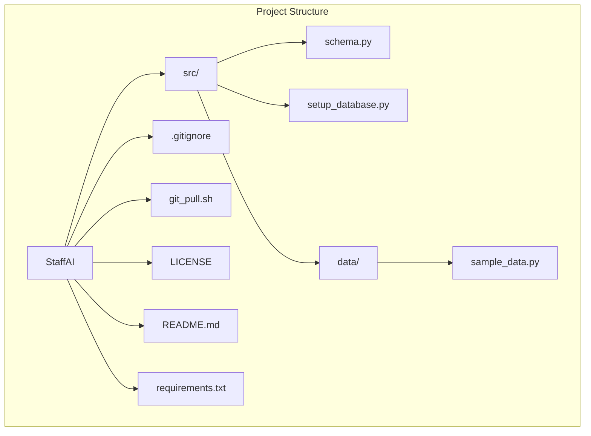
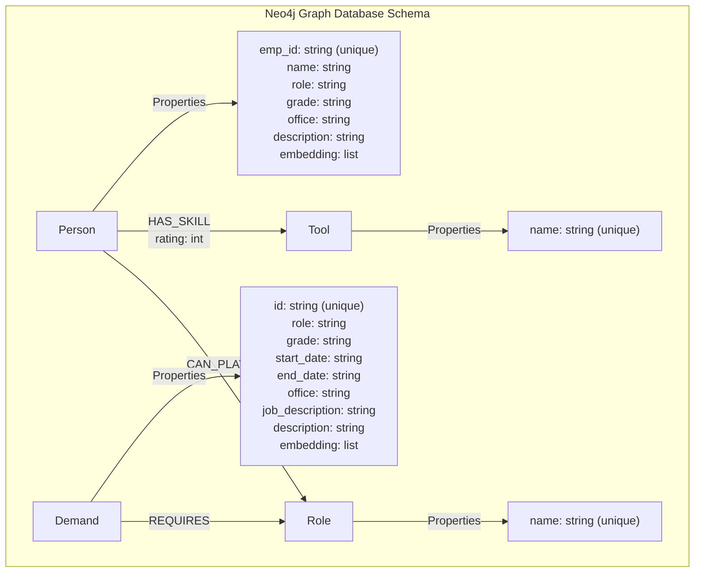
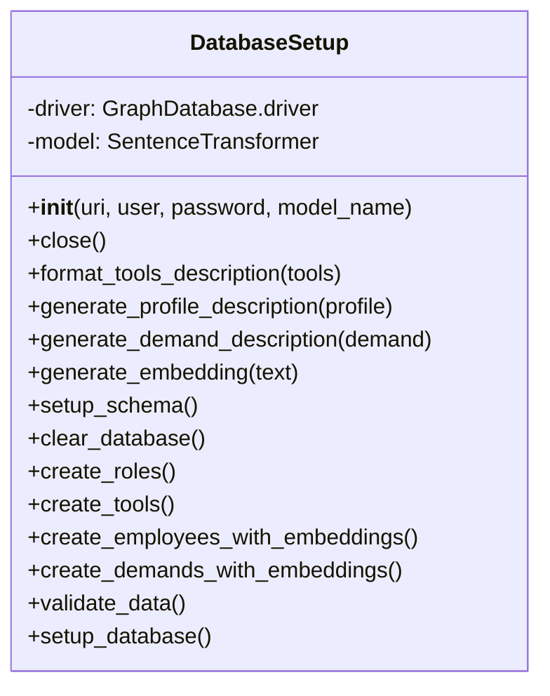
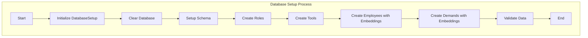
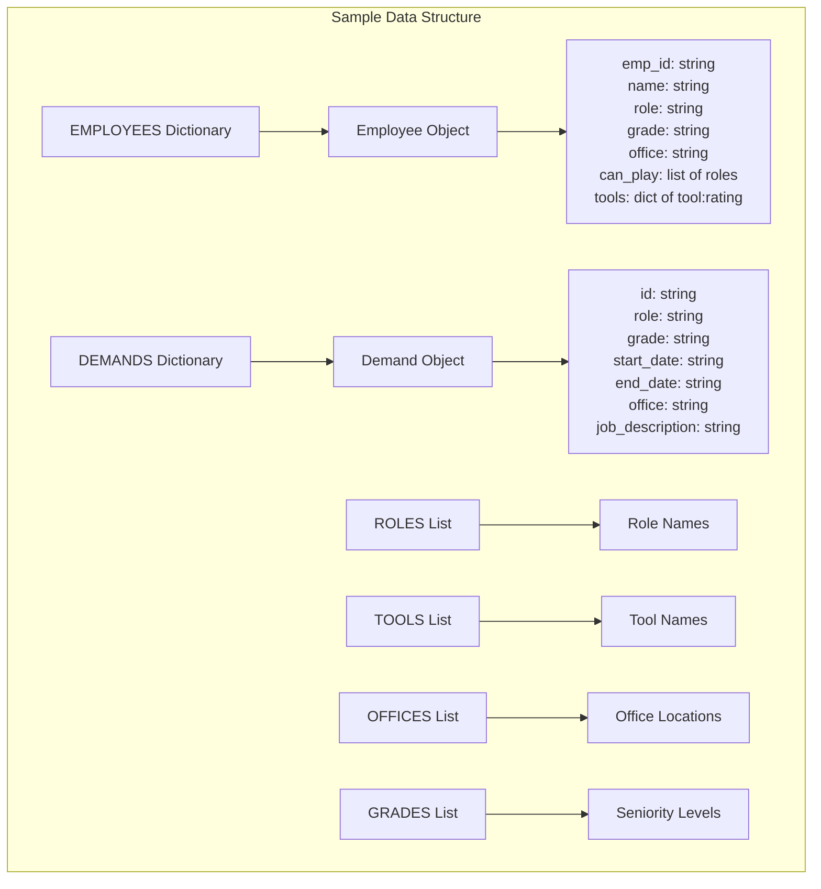
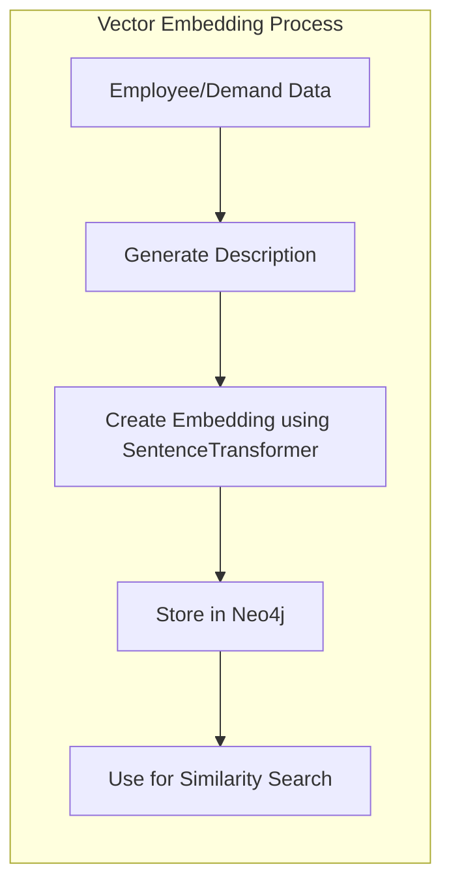

# StaffAI Codebase Diagram

## File Structure

```mermaid
graph TD
    subgraph "Project Structure"
        A[StaffAI] --> B[src/]
        A --> C[.gitignore]
        A --> D[git_pull.sh]
        A --> E[LICENSE]
        A --> F[README.md]
        A --> G[requirements.txt]
        
        B --> H[schema.py]
        B --> I[setup_database.py]
        B --> J[data/]
        J --> K[sample_data.py]
    end
```

## Database Schema

```mermaid
graph TD
    subgraph "Neo4j Graph Database Schema"
        Person[Person] -->|CAN_PLAY| Role[Role]
        Person -->|HAS_SKILL<br>rating: int| Tool[Tool]
        Demand[Demand] -->|REQUIRES| Role
        
        Person -->|Properties| PersonProps["
            emp_id: string (unique)
            name: string
            role: string
            grade: string
            office: string
            description: string
            embedding: list
        "]
        
        Role -->|Properties| RoleProps["
            name: string (unique)
        "]
        
        Tool -->|Properties| ToolProps["
            name: string (unique)
        "]
        
        Demand -->|Properties| DemandProps["
            id: string (unique)
            role: string
            grade: string
            start_date: string
            end_date: string
            office: string
            job_description: string
            description: string
            embedding: list
        "]
    end
```

## Class Diagram

```mermaid
classDiagram
    class DatabaseSetup {
        -driver: GraphDatabase.driver
        -model: SentenceTransformer
        +__init__(uri, user, password, model_name)
        +close()
        +format_tools_description(tools)
        +generate_profile_description(profile)
        +generate_demand_description(demand)
        +generate_embedding(text)
        +setup_schema()
        +clear_database()
        +create_roles()
        +create_tools()
        +create_employees_with_embeddings()
        +create_demands_with_embeddings()
        +validate_data()
        +setup_database()
    }
```

## Data Flow

```mermaid
flowchart TD
    subgraph "Database Setup Process"
        A[Start] --> B[Initialize DatabaseSetup]
        B --> C[Clear Database]
        C --> D[Setup Schema]
        D --> E[Create Roles]
        E --> F[Create Tools]
        F --> G[Create Employees with Embeddings]
        G --> H[Create Demands with Embeddings]
        H --> I[Validate Data]
        I --> J[End]
    end
```

## Sample Data Structure

```mermaid
graph TD
    subgraph "Sample Data Structure"
        EMPLOYEES["EMPLOYEES Dictionary"] --> Employee["Employee Object"]
        Employee --> EmpProps["
            emp_id: string
            name: string
            role: string
            grade: string
            office: string
            can_play: list of roles
            tools: dict of tool:rating
        "]
        
        DEMANDS["DEMANDS Dictionary"] --> Demand["Demand Object"]
        Demand --> DemandProps["
            id: string
            role: string
            grade: string
            start_date: string
            end_date: string
            office: string
            job_description: string
        "]
        
        ROLES["ROLES List"] --> Role["Role Names"]
        TOOLS["TOOLS List"] --> Tool["Tool Names"]
        OFFICES["OFFICES List"] --> Office["Office Locations"]
        GRADES["GRADES List"] --> Grade["Seniority Levels"]
    end
```

## Vector Embedding Process

```mermaid
flowchart LR
    subgraph "Vector Embedding Process"
        A[Employee/Demand Data] --> B[Generate Description]
        B --> C[Create Embedding using SentenceTransformer]
        C --> D[Store in Neo4j]
        D --> E[Use for Similarity Search]
    end
```
